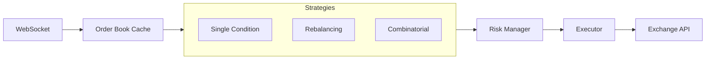

<div align="center">
  

  <p><strong>Multi-strategy arbitrage detection and execution for prediction markets</strong></p>

  <p>
    <a href="https://github.com/usealtoal/edgelord/actions/workflows/ci.yml"></a>
    <a href="LICENSE"></a>
    
  </p>

  <hr width="60%">
</div>

## What It Does

Detects and executes arbitrage opportunities on prediction markets. Based on [research](https://arxiv.org/abs/2508.03474) showing $40M in arbitrage profits extracted from Polymarket in one year.

Three detection strategies, ordered by historical profit share:

| Strategy | What It Finds | Profit Share |
|----------|---------------|--------------|
| Market Rebalancing | Sum of all outcomes < $1 | 73% ($29M) |
| Single-Condition | YES + NO < $1 | 27% ($10.5M) |
| Combinatorial | Cross-market logical dependencies | <1% ($95K) |

## Quick Start

```bash
# Clone and build
git clone https://github.com/usealtoal/edgelord.git
cd edgelord
cargo build --release

# Configure (copy and edit)
cp config.toml.example config.toml

# Run
./target/release/edgelord run
```

See [Getting Started](doc/getting-started.md) for detailed setup including environment variables and configuration options.

## How It Works

The system connects to prediction market exchanges via WebSocket, maintaining a real-time order book cache. When prices update, registered detection strategies scan for arbitrage opportunities. Each strategy implements a different detection algorithm—from simple price sum checks to Frank-Wolfe optimization over the marginal polytope.

When an opportunity passes minimum thresholds (edge, profit, volume), it goes through risk management checks: position limits, exposure caps, slippage tolerance. Approved opportunities execute via the exchange's order API. The system handles partial fills, order cancellation, and maintains position tracking throughout.



## Documentation

- **[Getting Started](doc/getting-started.md)** — Installation, configuration, first run
- **[Architecture](doc/architecture/overview.md)** — System design and data flow
- **[Strategies](doc/strategies/overview.md)** — How each detection algorithm works
- **[Configuration](doc/configuration.md)** — All options explained

Implementation plans and research notes live in `doc/plans/` and `doc/research/`.

## Status

- [x] Foundation — WebSocket, order book cache, market data
- [x] Detection — Single-condition and rebalancing strategies
- [x] Execution — Order submission, position tracking
- [x] Risk Management — Limits, circuit breakers, slippage checks
- [x] Multi-Exchange Abstraction — Generic traits, Polymarket implementation
- [ ] Mainnet — Production deployment

## License

MIT
