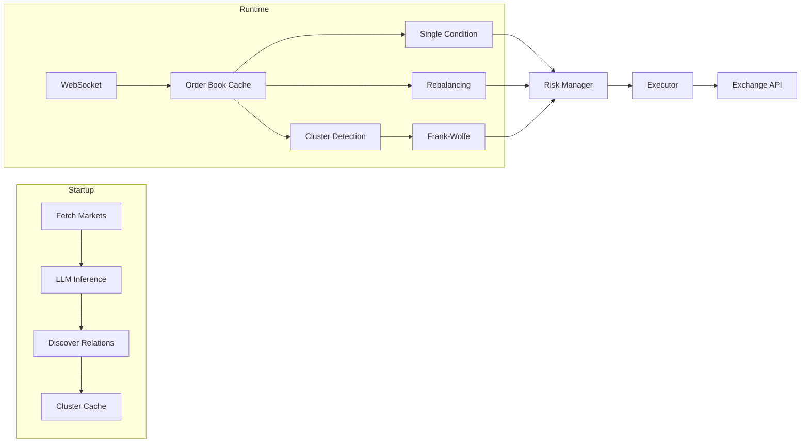

<div align="center">
  

  <p><strong>Multi-strategy arbitrage detection and execution for prediction markets, written in Rust</strong></p>

  <p>
    <a href="https://github.com/usealtoal/edgelord/actions/workflows/ci.yml"></a>
    
    
  </p>

</div>

## What It Does

Detects and executes arbitrage opportunities on prediction markets. Based on [research](https://arxiv.org/abs/2508.03474) showing $40M in arbitrage profits extracted from Polymarket in one year.

Three detection strategies, ordered by historical profit share:

| Strategy | What It Finds | Profit Share |
|----------|---------------|--------------|
| Market Rebalancing | Sum of all outcomes < $1 | 73% ($29M) |
| Single-Condition | YES + NO < $1 | 27% ($10.5M) |
| Combinatorial | Cross-market logical dependencies | <1% ($95K) |

**New:** LLM-powered relation inference automatically discovers which markets are correlated, enabling combinatorial arbitrage without manual configuration.

## Quick Start

```bash
# Clone and build
git clone https://github.com/usealtoal/edgelord.git
cd edgelord
cargo build --release

# Configure (copy and edit)
# Provision (recommended for Polymarket)
export EDGELORD_KEYSTORE_PASSWORD="..."        # Keystore passphrase
./target/release/edgelord provision polymarket --config config.polymarket.toml

# Or manual config
cp config.toml.example config.toml
export WALLET_PRIVATE_KEY="..."                # For execution
export ANTHROPIC_API_KEY="..."         # For relation inference

# Run
./target/release/edgelord run --config config.polymarket.toml
```

See [Getting Started](docs/getting-started.md) for detailed setup.

## How It Works



**Startup:**
1. Fetch active markets from exchange
2. Run LLM inference to discover market relations (if enabled)
3. Build clusters of related markets with pre-computed constraints

**Runtime:**
1. WebSocket streams order book updates
2. Per-market strategies (single-condition, rebalancing) check each update
3. Cluster detection service monitors related markets, runs Frank-Wolfe when prices change
4. Opportunities pass through risk management and execute

## Configuration

Key settings in `config.toml`:

```toml
[strategies]
enabled = ["single_condition", "market_rebalancing", "combinatorial"]

[strategies.combinatorial]
enabled = true

[inference]
enabled = true              # LLM discovers market relations

[cluster_detection]
enabled = true              # Real-time cluster arbitrage detection

[llm]
provider = "anthropic"      # or "openai"
```

See [Configuration](docs/configuration.md) for all options.

## Documentation

- **[Getting Started](docs/getting-started.md)** — Installation, configuration, first run
- **[Configuration](docs/configuration.md)** — All options explained
- **[Strategies](docs/strategies/overview.md)** — How each detection algorithm works
- **[Architecture](docs/architecture/overview.md)** — System design and data flow
- **[Deployment](docs/deployment/)** — VPS, wallet, Telegram alerts, operations

Implementation plans and research notes live in `docs/plans/` and `docs/research/`.

## Project Structure

```
src/
├── core/
│   ├── domain/         # Pure types (Market, Relation, Cluster)
│   ├── exchange/       # Exchange abstraction + Polymarket impl
│   ├── strategy/       # Detection algorithms
│   ├── inference/      # LLM-powered relation discovery
│   ├── llm/            # Anthropic/OpenAI clients
│   ├── cache/          # Order book + cluster caches
│   ├── store/          # Persistence (SQLite, memory)
│   ├── solver/         # Frank-Wolfe, HiGHS ILP
│   └── service/        # Cluster detection, risk, notifications
├── app/                # Orchestration, config, CLI
└── cli/                # Command handlers
```

## Status

- [x] Foundation — WebSocket, order book cache, market data
- [x] Detection — Single-condition and rebalancing strategies
- [x] Execution — Order submission, position tracking
- [x] Risk Management — Limits, circuit breakers, slippage checks
- [x] Multi-Exchange Abstraction — Generic traits, Polymarket implementation
- [x] LLM Inference — Automatic relation discovery
- [x] Combinatorial Strategy — Frank-Wolfe + cluster detection
- [ ] Mainnet Validation — Production testing with real capital

## License

Proprietary. All rights reserved.
