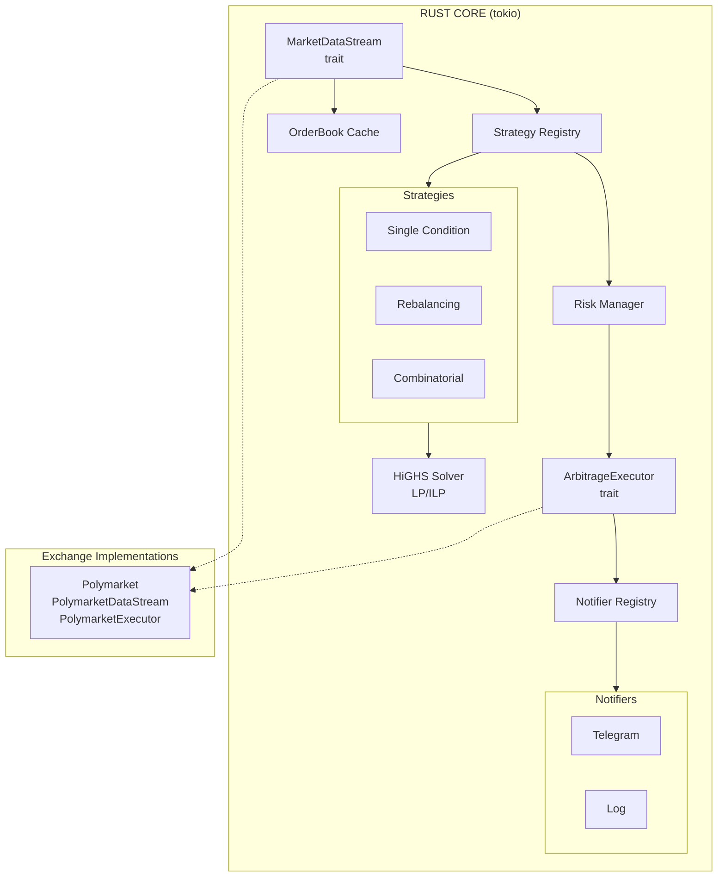

# edgelord

> Finding edges like a true edgelord.

A Rust-based multi-strategy arbitrage detection and execution system for prediction markets.

## What This Does

Detects and exploits arbitrage opportunities on prediction markets using pluggable detection strategies:

| Strategy | Description | Historical Profit Share |
|----------|-------------|------------------------|
| **Single-condition** | YES + NO < $1.00 | 26.7% ($10.5M) |
| **Market rebalancing** | Sum of all outcomes < $1.00 | 73.1% ($29M) |
| **Combinatorial** | Frank-Wolfe + ILP for correlated markets | 0.24% ($95K) |

Based on research showing $40M in arbitrage profits extracted from Polymarket in one year.

## Architecture



**Design principles:**
- **Strategy pattern:** Pluggable detection algorithms via `Strategy` trait
- **Exchange abstraction:** Generic `Market`, `Opportunity` types with configurable payouts; Polymarket-specific code isolated with `Polymarket` prefix
- **Domain-driven:** Exchange-agnostic core logic in `core/domain/`
- **Solver abstraction:** Swappable LP/ILP backends (HiGHS by default)
- **Type safety:** Newtypes for identifiers, Decimal for money (never floats)

See [doc/architecture/system-design.md](doc/architecture/system-design.md) for details.

## Project Structure

```
src/
├── lib.rs                 # Library root with public API
├── main.rs                # Thin binary entry point
├── error.rs               # Structured error types
│
├── core/                  # Reusable library components
│   ├── cache/             # Stateful caches and repositories
│   │   ├── orderbook.rs   # OrderBookCache (thread-safe)
│   │   └── position.rs    # PositionTracker
│   │
│   ├── domain/            # Pure domain types (exchange-agnostic)
│   │   ├── id.rs          # TokenId, MarketId (newtypes)
│   │   ├── money.rs       # Price, Volume (type aliases)
│   │   ├── market.rs      # Market (N outcomes), Outcome
│   │   ├── market_registry.rs # MarketRegistry (token→market lookup)
│   │   ├── orderbook.rs   # PriceLevel, OrderBook
│   │   ├── opportunity.rs # Opportunity, OpportunityLeg
│   │   └── position.rs    # Position, PositionId, PositionLeg, PositionStatus
│   │
│   ├── exchange/          # Exchange traits + implementations
│   │   ├── mod.rs         # Traits (OrderExecutor, MarketFetcher, ArbitrageExecutor, etc.)
│   │   ├── traits.rs      # ExchangeConfig trait for exchange-specific settings
│   │   ├── factory.rs     # ExchangeFactory for runtime exchange selection
│   │   └── polymarket/    # Polymarket implementation (all types prefixed)
│   │       ├── client.rs  # PolymarketClient (MarketFetcher impl)
│   │       ├── config.rs  # PolymarketExchangeConfig, POLYMARKET_PAYOUT
│   │       ├── executor.rs# PolymarketExecutor (OrderExecutor, ArbitrageExecutor)
│   │       ├── websocket.rs# PolymarketDataStream (MarketDataStream impl)
│   │       ├── messages.rs# PolymarketWsMessage, PolymarketBookMessage
│   │       └── types.rs   # PolymarketMarket, PolymarketToken
│   │
│   ├── strategy/          # Pluggable detection strategies
│   │   ├── single_condition.rs    # YES + NO < $1
│   │   ├── market_rebalancing.rs  # Sum of outcomes < $1
│   │   └── combinatorial/         # Frank-Wolfe + ILP
│   │
│   ├── solver/            # LP/ILP solver abstraction
│   │   └── highs.rs       # HiGHS implementation
│   │
│   └── service/           # Cross-cutting services
│       ├── risk.rs        # RiskManager with limits & circuit breakers
│       ├── notifier.rs    # Notifier trait + registry
│       └── telegram.rs    # Telegram notifier (feature-gated)
│
└── app/                   # Application orchestration
    ├── config.rs          # Configuration loading
    ├── orchestrator.rs    # Main application loop
    └── state.rs           # Shared application state
```

## Configuration

```toml
exchange = "polymarket"

[exchange_config]
type = "polymarket"
environment = "testnet"        # or "mainnet"
chain_id = 80002               # 80002=testnet, 137=mainnet

[strategies]
enabled = ["single_condition", "market_rebalancing"]

[strategies.single_condition]
min_edge = 0.05      # 5% minimum edge
min_profit = 0.50    # $0.50 minimum profit

[strategies.market_rebalancing]
min_edge = 0.03      # 3% minimum edge
min_profit = 1.00    # $1.00 minimum profit
max_outcomes = 10    # Skip markets with >10 outcomes

[strategies.combinatorial]
enabled = false      # Requires dependency configuration
max_iterations = 20
tolerance = 0.0001
gap_threshold = 0.02

[risk]
max_position_per_market = 1000   # $1000 max per market
max_total_exposure = 10000       # $10000 total portfolio limit
min_profit_threshold = 0.05      # $0.05 minimum profit
max_slippage = 0.02              # 2% maximum slippage

[telegram]
enabled = false                  # Set to true to enable
notify_opportunities = false     # Alert on new opportunities
notify_executions = true         # Alert on trade executions
notify_risk_rejections = true    # Alert when risk manager rejects

[reconnection]
initial_delay_ms = 1000        # Initial reconnection delay
max_delay_ms = 60000           # Maximum backoff delay (60s)
backoff_multiplier = 2.0       # Exponential backoff factor
max_consecutive_failures = 10  # Circuit breaker threshold
circuit_breaker_cooldown_ms = 300000  # 5 minute cooldown after tripping
```

## CLI Usage

```bash
# Run interactively (with banner, colored logs)
edgelord run

# Run for production (no banner, JSON logs)
edgelord run --no-banner --json-logs

# Override settings
edgelord run --chain-id 137 --max-exposure 5000 --telegram-enabled

# Check service status
edgelord status

# View logs
edgelord logs -f
edgelord logs --lines 100
edgelord logs --since "1 hour ago"

# Install as systemd service (requires root)
sudo edgelord install --config /opt/edgelord/config.toml

# Uninstall service
sudo edgelord uninstall
```

### Configuration Priority

Settings are applied in this order (later overrides earlier):

1. Built-in defaults
2. Config file (`config.toml`)
3. CLI flags (`--chain-id`, `--max-exposure`, etc.)
4. Environment variables (secrets only)

## Environment Variables

```bash
# Required for trading
export WALLET_PRIVATE_KEY="0x..."

# Required for Telegram notifications (when telegram feature enabled)
export TELEGRAM_BOT_TOKEN="your-bot-token"
export TELEGRAM_CHAT_ID="your-chat-id"
```

To enable Telegram notifications:
```bash
cargo build --features telegram
```

## Tech Stack

- **Language:** Rust 2021 (maximum latency edge)
- **Async runtime:** tokio
- **LP/ILP Solver:** HiGHS via good_lp
- **Decimals:** rust_decimal (never floats for money)
- **Chain:** Polygon (mainnet) / Amoy (testnet)

## Documentation

```
doc/
├── research/
│   ├── polymarket-arbitrage.md   # The math and strategy
│   └── polymarket-technical.md   # API and infrastructure
├── architecture/
│   └── system-design.md          # System architecture
└── plans/
    └── (implementation plans)
```

## Status

- [x] **Phase 1: Foundation** — WebSocket, market data, order book cache
- [x] **Phase 2: Detection** — Single-condition arbitrage scanner
- [x] **Phase 3: Execution** — Order submission on Amoy testnet
- [x] **Multi-Strategy** — Pluggable strategy system with Frank-Wolfe + ILP
- [x] **Phase 4: Risk & Alerts** — Risk manager, circuit breakers, Telegram notifications
- [x] **Structure Refactor** — Reorganized into `core/` and `app/` hierarchy
- [x] **Multi-Exchange Abstraction** — Generic types, `ExchangeConfig` trait, orchestrator decoupled from Polymarket
- [ ] **Phase 5: Mainnet** — Production deployment with real funds

## References

- [Unravelling the Probabilistic Forest (arXiv:2508.03474)](https://arxiv.org/abs/2508.03474)
- [Arbitrage-Free Combinatorial Market Making (arXiv:1606.02825)](https://arxiv.org/abs/1606.02825)
- [Polymarket CLOB Docs](https://docs.polymarket.com/developers/CLOB/introduction)
- [HiGHS LP Solver](https://highs.dev/)

## Disclaimer

This is for educational purposes. Trading involves risk. Don't trade money you can't afford to lose. The authors of the referenced research extracted $40M; you probably won't.
