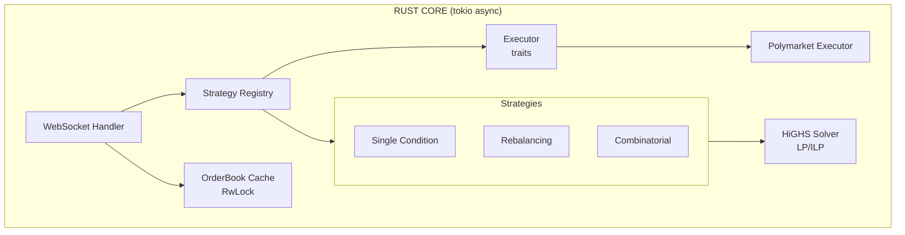
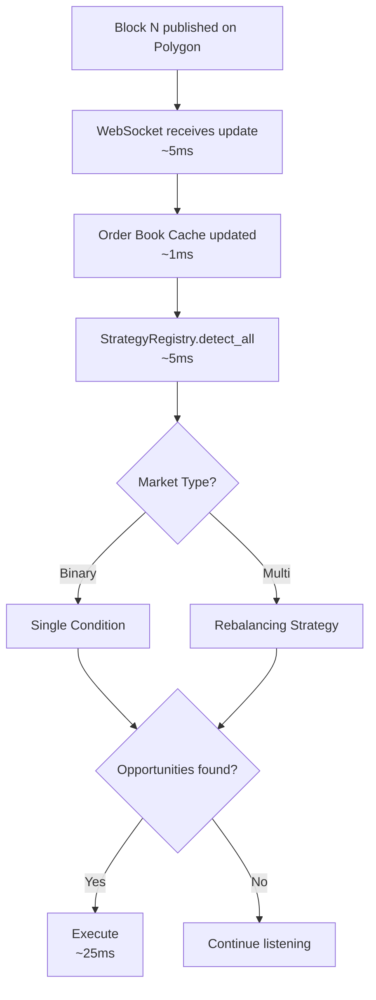

# edgelord System Architecture

> "Finding edges like a true edgelord"

## Design Philosophy

1. **Hot path must be <40ms** — Compete with sophisticated actors
2. **Strategy pattern** — Pluggable detection algorithms
3. **Domain-driven design** — Exchange-agnostic core, exchange-specific adapters
4. **Solver abstraction** — Swappable LP/ILP backends
5. **Fail safe** — Never lose money on a "guaranteed" trade

---

## High-Level Architecture



## Module Structure

```
src/
├── lib.rs                 # Library root with public API
├── main.rs                # Thin binary entry point
├── error.rs               # Structured error types
│
├── app/                   # Application layer
│   ├── mod.rs             # Module exports
│   ├── config.rs          # Configuration loading
│   ├── orchestrator.rs    # Main application loop
│   └── state.rs           # Application state management
│
├── domain/                # Exchange-agnostic (NO exchange imports)
│   ├── id.rs             # TokenId, MarketId (newtypes)
│   ├── money.rs           # Price, Volume types
│   ├── market.rs          # MarketPair, MarketInfo
│   ├── orderbook.rs       # OrderBook, OrderBookCache
│   ├── opportunity.rs     # Opportunity with builder
│   ├── position.rs        # Position tracking
│   ├── detector.rs        # Legacy re-export
│   │
│   ├── strategy/          # Pluggable detection strategies
│   │   ├── mod.rs         # Strategy trait + StrategyRegistry
│   │   ├── context.rs     # DetectionContext, MarketContext
│   │   ├── single_condition.rs    # YES + NO < $1
│   │   ├── market_rebalancing.rs  # Sum of outcomes < $1
│   │   └── combinatorial/         # Frank-Wolfe + ILP
│   │       ├── mod.rs             # CombinatorialStrategy
│   │       ├── bregman.rs         # Bregman divergence (KL)
│   │       └── frank_wolfe.rs     # Frank-Wolfe algorithm
│   │
│   └── solver/            # LP/ILP solver abstraction
│       ├── mod.rs         # Solver trait + types
│       └── highs.rs       # HiGHS implementation
│
├── service/               # Cross-cutting services
│   ├── mod.rs             # Module exports
│   ├── risk.rs            # RiskManager with limits & circuit breakers
│   ├── notifier.rs        # NotifierRegistry trait + registry
│   └── telegram.rs        # Telegram notifier (feature-gated)
│
├── exchange/              # Abstraction layer
│   ├── mod.rs             # Module exports
│   └── traits.rs          # ExchangeClient, OrderExecutor
│
└── adapter/               # Exchange implementations
    ├── mod.rs             # Module exports
    └── polymarket/        # Polymarket implementation
        ├── mod.rs         # Module exports
        ├── client.rs      # REST client
        ├── executor.rs    # OrderExecutor implementation
        ├── websocket.rs   # WS handler
        ├── messages.rs    # WS types + to_orderbook()
        ├── registry.rs    # YES/NO pair mapping
        └── types.rs       # API types
```

---

## Service Layer

The service layer provides cross-cutting concerns that operate across the application.

### RiskManager

Validates opportunities against configurable risk limits before execution:

```rust
pub struct RiskManager {
    limits: RiskLimits,
    circuit_breaker: CircuitBreaker,
}

impl RiskManager {
    /// Check if an opportunity passes all risk checks.
    pub fn check(&self, opportunity: &Opportunity, state: &AppState) -> RiskDecision;

    /// Record execution result and update circuit breaker state.
    pub fn record_execution(&mut self, result: &ExecutionResult);
}
```

**Risk Limits:**
- `max_position_per_market`: Maximum exposure per individual market
- `max_total_exposure`: Maximum total portfolio exposure
- `min_profit_threshold`: Minimum profit required to execute
- `max_slippage`: Maximum acceptable slippage

**Circuit Breakers:**
- Consecutive failure threshold triggers trading halt
- Configurable cooldown period before resuming

### NotifierRegistry

Manages multiple notification backends for alerts and monitoring:

```rust
#[async_trait]
pub trait Notifier: Send + Sync {
    fn name(&self) -> &'static str;
    async fn notify(&self, event: &NotificationEvent) -> Result<()>;
}

pub struct NotifierRegistry {
    notifiers: Vec<Box<dyn Notifier>>,
}
```

**Notification Events:**
- `OpportunityDetected`: New arbitrage opportunity found
- `ExecutionCompleted`: Trade executed successfully
- `ExecutionFailed`: Trade execution failed
- `RiskRejection`: Opportunity rejected by risk manager
- `CircuitBreakerTripped`: Trading halted due to failures

### TelegramNotifier (feature-gated)

Real-time alerts via Telegram bot (requires `telegram` feature):

```rust
// Enable with: cargo build --features telegram
let notifier = TelegramNotifier::from_env()?;
registry.register(Box::new(notifier));
```

---

## Strategy System

### Strategy Trait

```rust
pub trait Strategy: Send + Sync {
    /// Unique identifier for this strategy.
    fn name(&self) -> &'static str;

    /// Check if this strategy applies to a given market.
    fn applies_to(&self, ctx: &MarketContext) -> bool;

    /// Detect opportunities given current market state.
    fn detect(&self, ctx: &DetectionContext) -> Vec<Opportunity>;

    /// Optional: warm-start from previous detection.
    fn warm_start(&mut self, previous: &DetectionResult) {}
}
```

### Strategy Registry

```rust
let mut registry = StrategyRegistry::new();
registry.register(Box::new(SingleConditionStrategy::new(config)));
registry.register(Box::new(MarketRebalancingStrategy::new(config)));

// Run all applicable strategies
let opportunities = registry.detect_all(&ctx);
```

### Available Strategies

| Strategy | Profit Share | Complexity | Markets |
|----------|-------------|------------|---------|
| SingleCondition | 26.7% ($10.5M) | O(1) | Binary |
| MarketRebalancing | 73.1% ($29M) | O(n) | Multi-outcome |
| Combinatorial | 0.24% ($95K) | O(ILP) | Correlated |

---

## Solver Abstraction

### Solver Trait

```rust
pub trait Solver: Send + Sync {
    fn name(&self) -> &'static str;
    fn solve_lp(&self, problem: &LpProblem) -> Result<LpSolution>;
    fn solve_ilp(&self, problem: &IlpProblem) -> Result<LpSolution>;
}
```

### HiGHS Implementation

Open-source LP/MIP solver via `good_lp` crate:

```rust
let solver = HiGHSSolver::new();
let solution = solver.solve_ilp(&problem)?;
```

**Performance targets:**
- <10ms per ILP solve
- 5-20 Frank-Wolfe iterations per tick
- <100ms total latency for combinatorial detection

---

## Frank-Wolfe Algorithm

The combinatorial strategy uses Frank-Wolfe projection onto the marginal polytope:

```
1. Start with current market prices θ
2. Compute gradient of Bregman divergence
3. Solve ILP oracle: find vertex minimizing gradient dot product
4. Update toward that vertex
5. Repeat until convergence or iteration limit
```

The gap between θ and the projection μ* indicates arbitrage potential.

### Bregman Divergence

For LMSR cost function, the Bregman divergence is KL divergence:

```rust
D(μ||θ) = Σ μᵢ * ln(μᵢ/θᵢ)
```

---

## Data Flow



---

## Configuration

```toml
[strategies]
enabled = ["single_condition", "market_rebalancing"]

[strategies.single_condition]
min_edge = 0.05      # 5% minimum edge
min_profit = 0.50    # $0.50 minimum profit

[strategies.market_rebalancing]
min_edge = 0.03      # 3% minimum edge
min_profit = 1.00    # $1.00 minimum profit
max_outcomes = 10    # Skip markets with >10 outcomes

[strategies.combinatorial]
enabled = false      # Requires dependency configuration
max_iterations = 20
tolerance = 0.0001
gap_threshold = 0.02

[risk]
max_position_per_market = 1000   # $1000 max per market
max_total_exposure = 10000       # $10000 total portfolio limit
min_profit_threshold = 0.05      # $0.05 minimum profit
max_slippage = 0.02              # 2% maximum slippage

[telegram]
enabled = false                  # Set to true to enable
notify_opportunities = false     # Alert on new opportunities
notify_executions = true         # Alert on trade executions
notify_risk_rejections = true    # Alert when risk manager rejects
```

**Environment Variables for Telegram:**
```bash
export TELEGRAM_BOT_TOKEN="your-bot-token"
export TELEGRAM_CHAT_ID="your-chat-id"
```

---

## Risk Management

### Position Limits
```rust
struct RiskLimits {
    max_position_per_market: Decimal,    // e.g., $1000
    max_total_exposure: Decimal,          // e.g., $10000
    min_profit_threshold: Decimal,        // e.g., $0.05
    max_slippage_tolerance: Decimal,      // e.g., 2%
}
```

### Circuit Breakers
- Stop trading if drawdown exceeds X%
- Stop trading if execution failure rate spikes
- Stop trading if WebSocket disconnects

---

## Tech Stack

```toml
[dependencies]
# Async runtime
tokio = { version = "1", features = ["full"] }

# LP/ILP solver
good_lp = { version = "1.8", features = ["highs"] }

# Decimal math (never floats)
rust_decimal = { version = "1", features = ["serde"] }

# Serialization
serde = { version = "1", features = ["derive"] }

# Logging
tracing = "0.1"
```

---

## Development Phases

### Phase 1: Foundation ✅ COMPLETE
- [x] Rust project setup with proper module structure
- [x] WebSocket connection to Polymarket
- [x] Order book cache with thread-safe access
- [x] Configuration and logging

### Phase 2: Detection ✅ COMPLETE
- [x] Single-condition detector (YES + NO < $1)
- [x] Domain types with proper encapsulation
- [x] Opportunity builder pattern
- [x] Comprehensive test coverage

### Phase 3: Execution ✅ COMPLETE
- [x] Exchange trait abstractions (OrderExecutor)
- [x] Polymarket executor implementation
- [x] Position tracking
- [x] Testnet integration (Amoy)

### Multi-Strategy Architecture ✅ COMPLETE
- [x] Strategy trait and StrategyRegistry
- [x] SingleConditionStrategy (refactored)
- [x] MarketRebalancingStrategy (new)
- [x] CombinatorialStrategy with Frank-Wolfe + ILP
- [x] Solver abstraction with HiGHS
- [x] Bregman divergence calculations
- [x] Configuration-driven strategy selection

### Phase 4: Risk & Telegram ✅ COMPLETE
- [x] Risk manager with limits and circuit breakers
- [x] Telegram bot for alerts (feature-gated)
- [x] Service layer architecture (RiskManager, NotifierRegistry)
- [x] App module refactoring (config, orchestrator, state)

### Phase 5: Mainnet
- [ ] Switch config to mainnet
- [ ] Start with small stakes ($50-100)
- [ ] Monitor and tune thresholds

---

## Future Work

1. **Dependency Detection** — LLM-assisted market correlation discovery
2. **Constraint Builder** — Encode logical dependencies as ILP constraints
3. **Multi-Market State** — Aggregate order books across correlated markets
4. **Warm-Starting** — Reuse solver state across detection cycles
5. **Gurobi Backend** — Optional high-performance solver for heavy workloads
