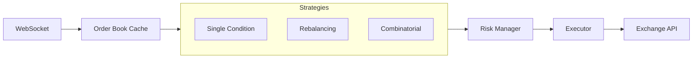
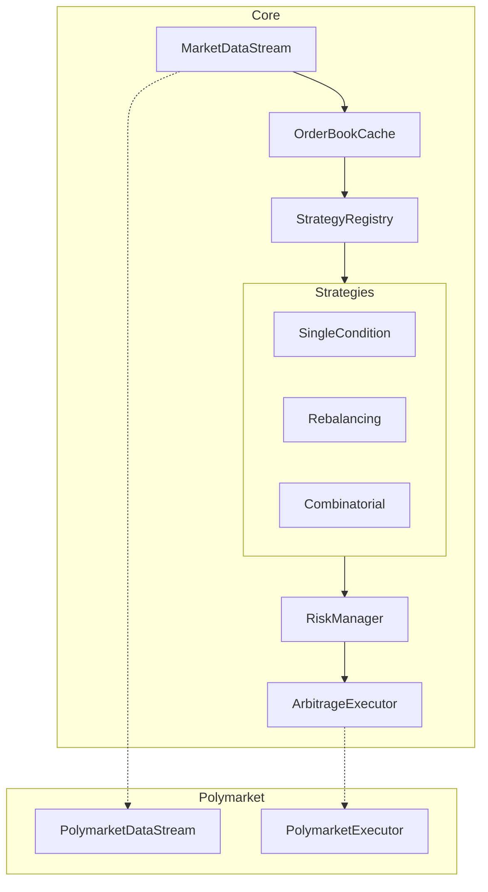
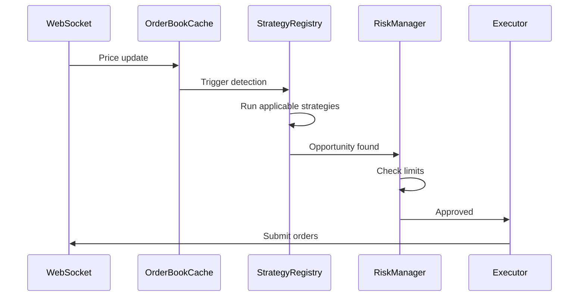
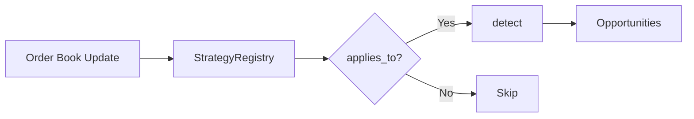

# Documentation Restructure Implementation Plan

> Status: Historical
> Superseded by: N/A
> Summary:
> - Goal: Create professional documentation with styled README and comprehensive docs in doc/.
> - Scope: Getting Started
> Planned Outcomes:
> - Getting Started
> - Reference


> **For Claude:** REQUIRED SUB-SKILL: Use superpowers:executing-plans to implement this plan task-by-task.

**Goal:** Create professional documentation with styled README and comprehensive docs in doc/.

**Architecture:** Plain markdown files with mermaid diagrams. README gets HTML/CSS header with banner and badges. Full docs live in doc/ with logical structure.

**Tech Stack:** Markdown, Mermaid, HTML/CSS for README header

---

## Task 1: Create CI Workflow for Badge

**Files:**
- Create: `.github/workflows/ci.yml`

**Changes:**

Create a basic CI workflow so the badge works:

```yaml
name: CI

on:
  push:
    branches: [main]
  pull_request:
    branches: [main]

env:
  CARGO_TERM_COLOR: always

jobs:
  check:
    runs-on: ubuntu-latest
    steps:
      - uses: actions/checkout@v4
      - uses: dtolnay/rust-action@stable
      - run: cargo check --all-targets
      - run: cargo test
      - run: cargo clippy -- -D warnings
```

**Verification:** File exists, valid YAML syntax

---

## Task 2: Create New README.md

**Files:**
- Replace: `README.md`

**Changes:**

```markdown
<div align="center">
  

  <p><strong>Multi-strategy arbitrage detection and execution for prediction markets</strong></p>

  <p>
    <a href="https://github.com/usealtoal/edgelord/actions/workflows/ci.yml"></a>
    <a href="LICENSE"></a>
    
  </p>

  <hr width="60%">
</div>

## What It Does

Detects and executes arbitrage opportunities on prediction markets. Based on [research](https://arxiv.org/abs/2508.03474) showing $40M in arbitrage profits extracted from Polymarket in one year.

Three detection strategies, ordered by historical profit share:

| Strategy | What It Finds | Profit Share |
|----------|---------------|--------------|
| Market Rebalancing | Sum of all outcomes < $1 | 73% ($29M) |
| Single-Condition | YES + NO < $1 | 27% ($10.5M) |
| Combinatorial | Cross-market logical dependencies | <1% ($95K) |

## Quick Start

```bash
# Clone and build
git clone https://github.com/usealtoal/edgelord.git
cd edgelord
cargo build --release

# Configure (copy and edit)
cp config.toml.example config.toml

# Run
./target/release/edgelord run
```

See [Getting Started](doc/getting-started.md) for detailed setup including environment variables and configuration options.

## How It Works

The system connects to prediction market exchanges via WebSocket, maintaining a real-time order book cache. When prices update, registered detection strategies scan for arbitrage opportunities. Each strategy implements a different detection algorithm—from simple price sum checks to Frank-Wolfe optimization over the marginal polytope.

When an opportunity passes minimum thresholds (edge, profit, volume), it goes through risk management checks: position limits, exposure caps, slippage tolerance. Approved opportunities execute via the exchange's order API. The system handles partial fills, order cancellation, and maintains position tracking throughout.



## Documentation

- **[Getting Started](doc/getting-started.md)** — Installation, configuration, first run
- **[Architecture](doc/architecture/overview.md)** — System design and data flow
- **[Strategies](doc/strategies/overview.md)** — How each detection algorithm works
- **[Configuration](doc/configuration.md)** — All options explained

Implementation plans and research notes live in `doc/plans/` and `doc/research/`.

## Status

- [x] Foundation — WebSocket, order book cache, market data
- [x] Detection — Single-condition and rebalancing strategies
- [x] Execution — Order submission, position tracking
- [x] Risk Management — Limits, circuit breakers, slippage checks
- [x] Multi-Exchange Abstraction — Generic traits, Polymarket implementation
- [ ] Mainnet — Production deployment

## License

MIT
```

**Verification:** `cat README.md | head -50`

---

## Task 3: Create doc/README.md (Documentation Home)

**Files:**
- Create: `doc/README.md`

**Changes:**

```markdown
# Documentation

Welcome to the edgelord documentation.

## Contents

### Getting Started
- **[Getting Started](getting-started.md)** — Prerequisites, installation, configuration, running

### Reference
- **[Configuration](configuration.md)** — All configuration options with defaults and examples
- **[Architecture](architecture/overview.md)** — System design, module structure, data flow

### Strategies
- **[Strategy Overview](strategies/overview.md)** — How the strategy system works
- **[Single-Condition](strategies/single-condition.md)** — Binary market arbitrage (YES + NO < $1)
- **[Market Rebalancing](strategies/market-rebalancing.md)** — Multi-outcome arbitrage (sum < $1)
- **[Combinatorial](strategies/combinatorial.md)** — Cross-market arbitrage via Frank-Wolfe + ILP

### Background
- **[Research](research/)** — Polymarket technical details and arbitrage theory
- **[Plans](plans/)** — Implementation plans (historical)
```

**Verification:** File exists

---

## Task 4: Create doc/getting-started.md

**Files:**
- Create: `doc/getting-started.md`

**Changes:**

```markdown
# Getting Started

This guide covers installation, configuration, and running edgelord.

## Prerequisites

- **Rust 1.75+** — Install via [rustup](https://rustup.rs/)
- **A Polymarket account** — For API access
- **Private key** — For signing transactions (testnet recommended for initial setup)

## Installation

```bash
git clone https://github.com/usealtoal/edgelord.git
cd edgelord
cargo build --release
```

The binary is at `./target/release/edgelord`.

## Configuration

Copy the example config:

```bash
cp config.toml.example config.toml
```

Key sections:

```toml
# Exchange selection
exchange = "polymarket"

[exchange_config]
environment = "testnet"  # Start with testnet
chain_id = 80002         # Amoy testnet (use 137 for mainnet)

# Which strategies to run
[strategies]
enabled = ["single_condition", "market_rebalancing"]

# Risk limits
[risk]
max_position_per_market = 100   # Start small
max_total_exposure = 500
```

See [Configuration](configuration.md) for all options.

## Environment Variables

Required for trading:

```bash
export WALLET_PRIVATE_KEY="0x..."
```

Optional for Telegram alerts (requires `--features telegram`):

```bash
export TELEGRAM_BOT_TOKEN="..."
export TELEGRAM_CHAT_ID="..."
```

## Running

Interactive mode with colored output:

```bash
./target/release/edgelord run
```

Production mode with JSON logs:

```bash
./target/release/edgelord run --no-banner --json-logs
```

Check status:

```bash
./target/release/edgelord status
```

## Verifying It Works

On startup, you should see:
1. Connection to WebSocket established
2. Markets being fetched and filtered
3. Order books populating
4. Strategies scanning (opportunities logged when found)

If using testnet, no real funds are at risk. Monitor the logs for a few minutes to confirm detection is working before considering mainnet.

## Next Steps

- Read [Architecture](architecture/overview.md) to understand the system
- Read [Strategies](strategies/overview.md) to understand detection algorithms
- Tune [Configuration](configuration.md) for your risk tolerance
```

**Verification:** File exists

---

## Task 5: Create doc/configuration.md

**Files:**
- Create: `doc/configuration.md`

**Changes:**

```markdown
# Configuration

All configuration lives in `config.toml`. Settings can be overridden via CLI flags or environment variables.

## Priority Order

1. Built-in defaults
2. Config file (`config.toml`)
3. CLI flags
4. Environment variables (secrets only)

## Exchange

```toml
exchange = "polymarket"

[exchange_config]
environment = "testnet"        # "testnet" or "mainnet"
chain_id = 80002               # 80002 (Amoy testnet) or 137 (Polygon mainnet)
```

## Strategies

```toml
[strategies]
enabled = ["single_condition", "market_rebalancing"]

[strategies.single_condition]
min_edge = 0.05      # Minimum profit margin (5%)
min_profit = 0.50    # Minimum dollar profit per trade

[strategies.market_rebalancing]
min_edge = 0.03      # Minimum profit margin (3%)
min_profit = 1.00    # Minimum dollar profit per trade
max_outcomes = 10    # Skip markets with more outcomes

[strategies.combinatorial]
enabled = false           # Requires dependency configuration
max_iterations = 20       # Frank-Wolfe iterations
tolerance = 0.0001        # Convergence threshold
gap_threshold = 0.02      # Minimum gap to act on
```

## Risk Management

```toml
[risk]
max_position_per_market = 1000   # Max exposure per market ($)
max_total_exposure = 10000       # Max total portfolio exposure ($)
min_profit_threshold = 0.05      # Skip opportunities below this ($)
max_slippage = 0.02              # Reject if slippage exceeds 2%
```

## Reconnection

```toml
[reconnection]
initial_delay_ms = 1000          # First retry delay
max_delay_ms = 60000             # Cap on exponential backoff
backoff_multiplier = 2.0         # Delay doubles each failure
max_consecutive_failures = 10    # Trips circuit breaker
circuit_breaker_cooldown_ms = 300000  # 5 min cooldown
```

## Telegram Notifications

Requires building with `--features telegram`:

```toml
[telegram]
enabled = true
notify_opportunities = false     # Alert on detection
notify_executions = true         # Alert on trades
notify_risk_rejections = true    # Alert on rejected opportunities
```

Environment variables (never put in config file):

```bash
export TELEGRAM_BOT_TOKEN="..."
export TELEGRAM_CHAT_ID="..."
```

## CLI Overrides

Common flags:

```bash
edgelord run --chain-id 137           # Override chain
edgelord run --max-exposure 5000      # Override risk limit
edgelord run --no-banner --json-logs  # Production mode
```

Run `edgelord run --help` for all options.
```

**Verification:** File exists

---

## Task 6: Create doc/architecture/overview.md

**Files:**
- Create: `doc/architecture/overview.md`
- Delete: `doc/architecture/system-design.md`

**Changes:**

```markdown
# Architecture Overview

This document covers system design, module structure, and data flow.

## Design Principles

1. **Low latency** — Hot path targets <40ms to compete with sophisticated traders
2. **Strategy pattern** — Pluggable detection algorithms via `Strategy` trait
3. **Exchange abstraction** — Generic traits with exchange-specific implementations
4. **Domain-driven** — Exchange-agnostic core types, Polymarket-prefixed adapters
5. **Fail safe** — Risk checks prevent executing bad trades

## System Overview



## Module Structure

```
src/
├── core/                  # Library code
│   ├── domain/            # Pure types (Market, Opportunity, OrderBook)
│   ├── exchange/          # Exchange traits + implementations
│   ├── strategy/          # Detection algorithms
│   ├── service/           # Risk, notifications, subscriptions
│   ├── solver/            # LP/ILP abstraction (HiGHS)
│   └── cache/             # OrderBookCache, PositionTracker
│
├── app/                   # Application orchestration
│   ├── config/            # Configuration loading
│   ├── orchestrator/      # Main event loop
│   └── state.rs           # Shared state
│
└── cli/                   # Command-line interface
```

## Data Flow

1. **WebSocket receives update** — Price change on exchange (~5ms)
2. **OrderBookCache updates** — Thread-safe cache refreshed (~1ms)
3. **Strategies scan** — Each applicable strategy checks for opportunities (~5ms)
4. **Risk manager validates** — Position limits, exposure, slippage (~1ms)
5. **Executor submits orders** — API calls to exchange (~25ms)
6. **Position tracker records** — Trade logged, exposure updated



## Key Traits

### Strategy

```rust
pub trait Strategy: Send + Sync {
    fn name(&self) -> &'static str;
    fn applies_to(&self, ctx: &MarketContext) -> bool;
    fn detect(&self, ctx: &DetectionContext) -> Vec<Opportunity>;
}
```

### MarketDataStream

```rust
#[async_trait]
pub trait MarketDataStream: Send {
    async fn connect(&mut self) -> Result<()>;
    async fn subscribe(&mut self, token_ids: &[TokenId]) -> Result<()>;
    async fn next_event(&mut self) -> Option<MarketEvent>;
}
```

### ArbitrageExecutor

```rust
#[async_trait]
pub trait ArbitrageExecutor: Send + Sync {
    async fn execute_arbitrage(&self, opp: &Opportunity) -> Result<ExecutionResult>;
    async fn cancel(&self, order_id: &OrderId) -> Result<()>;
}
```

## Risk Management

The `RiskManager` validates every opportunity before execution:

- **Position limits** — Max exposure per market
- **Total exposure** — Portfolio-wide cap
- **Profit threshold** — Skip tiny opportunities
- **Slippage check** — Reject if prices moved too much

Circuit breakers halt trading after consecutive failures, with configurable cooldown.

## Connection Resilience

`ReconnectingDataStream` wraps WebSocket connections with:

- Exponential backoff on failures
- Automatic resubscription after reconnect
- Circuit breaker after N consecutive failures

See [Configuration](../configuration.md) for tuning parameters.
```

**Verification:** File exists, old file deleted

---

## Task 7: Create doc/strategies/overview.md

**Files:**
- Create: `doc/strategies/overview.md`

**Changes:**

```markdown
# Strategy System

The strategy system provides pluggable arbitrage detection. Each strategy implements the `Strategy` trait and registers with the `StrategyRegistry`.

## How It Works

On each order book update:

1. `StrategyRegistry` iterates registered strategies
2. Each strategy's `applies_to()` filters by market type
3. Applicable strategies run `detect()` on current state
4. All found opportunities collect and pass to risk manager



## Available Strategies

| Strategy | Market Type | Complexity | Historical Share |
|----------|------------|------------|------------------|
| [Single-Condition](single-condition.md) | Binary (2 outcomes) | O(1) | 27% ($10.5M) |
| [Market Rebalancing](market-rebalancing.md) | Multi-outcome (3+) | O(n) | 73% ($29M) |
| [Combinatorial](combinatorial.md) | Correlated markets | O(ILP) | <1% ($95K) |

## The Strategy Trait

```rust
pub trait Strategy: Send + Sync {
    /// Unique name for logging and config
    fn name(&self) -> &'static str;

    /// Should this strategy run for this market?
    fn applies_to(&self, ctx: &MarketContext) -> bool;

    /// Find opportunities in current market state
    fn detect(&self, ctx: &DetectionContext) -> Vec<Opportunity>;

    /// Optional: warm-start from previous run
    fn warm_start(&mut self, previous: &DetectionResult) {}
}
```

## Configuration

Enable strategies in `config.toml`:

```toml
[strategies]
enabled = ["single_condition", "market_rebalancing"]
```

Each strategy has its own config section. See individual strategy docs for parameters.

## Adding a New Strategy

1. Create module in `src/core/strategy/`
2. Implement `Strategy` trait
3. Add config struct with `#[derive(Deserialize)]`
4. Register in strategy builder
5. Document in `doc/strategies/`
```

**Verification:** File exists

---

## Task 8: Create doc/strategies/single-condition.md

**Files:**
- Create: `doc/strategies/single-condition.md`

**Changes:**

```markdown
# Single-Condition Strategy

Detects arbitrage in binary markets where YES + NO < $1.

## What It Detects

In a binary prediction market, exactly one outcome wins and pays $1. If you can buy both YES and NO for less than $1 total, you profit the difference.

**Example:**
- YES asking $0.45
- NO asking $0.50
- Total cost: $0.95
- Guaranteed payout: $1.00
- Profit: $0.05 per share

## Intuition

Market makers and traders don't always keep prices perfectly balanced. Temporary imbalances—from large orders, slow updates, or thin liquidity—create windows where the sum drops below $1.

This captured 27% ($10.5M) of historical arbitrage profits. It's the simplest strategy but still profitable because these mispricings happen frequently in less liquid markets.

## The Math

For a binary market with outcomes A and B:

```
Edge = Payout - (Ask_A + Ask_B)
```

Where:
- `Payout` = $1.00 (configurable per exchange)
- `Ask_A` = best ask price for outcome A
- `Ask_B` = best ask price for outcome B

Arbitrage exists when `Edge > 0`.

**Volume** is limited by the smaller side:
```
Volume = min(Size_A, Size_B)
```

**Expected profit**:
```
Profit = Edge × Volume
```

## Worked Example

Market: "Will it rain tomorrow?"

| Outcome | Best Ask | Size |
|---------|----------|------|
| YES | $0.42 | 150 |
| NO | $0.52 | 100 |

Calculations:
- Total cost: $0.42 + $0.52 = $0.94
- Edge: $1.00 - $0.94 = $0.06 (6%)
- Volume: min(150, 100) = 100
- Expected profit: $0.06 × 100 = $6.00

Action: Buy 100 YES at $0.42 and 100 NO at $0.52. One pays $1, profit $6.

## How It's Used

**Location:** `src/core/strategy/condition/single.rs`

**Trait implementation:**
- `applies_to()` returns true for binary markets (2 outcomes)
- `detect()` calls `detect_single_condition()` with market and cache

**Pipeline:**
1. WebSocket update triggers detection
2. Strategy checks if market is binary
3. Fetches best asks from `OrderBookCache`
4. Calculates edge and profit
5. Returns `Opportunity` if thresholds met

**Output:** `Opportunity` struct with two legs (one per outcome).

## Configuration

```toml
[strategies.single_condition]
min_edge = 0.05      # Minimum edge (5%)
min_profit = 0.50    # Minimum profit ($0.50)
```

- **min_edge**: Skip if edge percentage is below this. Higher = fewer but safer trades.
- **min_profit**: Skip if dollar profit is below this. Filters noise from tiny opportunities.

## Limitations

- **Binary only**: Doesn't handle multi-outcome markets (use Market Rebalancing)
- **Best ask only**: Ignores deeper liquidity; large orders may not fill at expected price
- **No partial fills**: Assumes full execution; reality may differ
- **Latency sensitive**: Opportunities disappear fast; sub-second detection matters
```

**Verification:** File exists

---

## Task 9: Create doc/strategies/market-rebalancing.md

**Files:**
- Create: `doc/strategies/market-rebalancing.md`

**Changes:**

```markdown
# Market Rebalancing Strategy

Detects arbitrage in multi-outcome markets where the sum of all outcomes < $1.

## What It Detects

In a market with N mutually exclusive outcomes, exactly one wins and pays $1. If you can buy all N outcomes for less than $1 total, you profit the difference.

**Example (3-way election):**
- Candidate A: $0.35
- Candidate B: $0.30
- Candidate C: $0.25
- Total cost: $0.90
- Guaranteed payout: $1.00
- Profit: $0.10 per set

## Intuition

Multi-outcome markets are harder to keep balanced. With N outcomes, there are more prices to track and more ways for the sum to drift. Market makers may not cover all outcomes equally, creating persistent imbalances.

This captured 73% ($29M) of historical arbitrage profits—the largest share by far. The extra complexity in pricing creates more opportunities.

## The Math

For a market with outcomes O₁, O₂, ..., Oₙ:

```
Edge = Payout - Σ Ask_i
```

Where:
- `Payout` = $1.00 (configurable)
- `Ask_i` = best ask price for outcome i

Arbitrage exists when `Edge > 0`.

**Volume** is limited by the smallest leg:
```
Volume = min(Size_1, Size_2, ..., Size_n)
```

**Expected profit**:
```
Profit = Edge × Volume
```

## Worked Example

Market: "Who wins the election?" (5 candidates)

| Candidate | Best Ask | Size |
|-----------|----------|------|
| A | $0.25 | 200 |
| B | $0.22 | 150 |
| C | $0.18 | 300 |
| D | $0.15 | 100 |
| E | $0.12 | 250 |

Calculations:
- Total cost: $0.25 + $0.22 + $0.18 + $0.15 + $0.12 = $0.92
- Edge: $1.00 - $0.92 = $0.08 (8%)
- Volume: min(200, 150, 300, 100, 250) = 100
- Expected profit: $0.08 × 100 = $8.00

Action: Buy 100 of each candidate. Winner pays $1, profit $8.

## How It's Used

**Location:** `src/core/strategy/rebalancing/mod.rs`

**Trait implementation:**
- `applies_to()` returns true for 3+ outcomes, up to `max_outcomes`
- `detect()` calls `detect_rebalancing()` with all token IDs

**Pipeline:**
1. WebSocket update triggers detection
2. Strategy checks outcome count (3 to max_outcomes)
3. Fetches best asks for all outcomes from cache
4. Sums prices, calculates edge
5. Returns `Opportunity` with N legs if thresholds met

**Output:** `Opportunity` struct with one leg per outcome.

## Configuration

```toml
[strategies.market_rebalancing]
min_edge = 0.03      # Minimum edge (3%)
min_profit = 1.00    # Minimum profit ($1.00)
max_outcomes = 10    # Skip markets with more outcomes
```

- **min_edge**: Lower than single-condition because multi-outcome is more common
- **min_profit**: Higher because more legs = more execution risk
- **max_outcomes**: Caps complexity; very large markets rarely have good liquidity across all outcomes

## Limitations

- **All-or-nothing**: Must buy all outcomes; partial coverage isn't arbitrage
- **Liquidity fragmentation**: Volume limited by thinnest outcome
- **Execution complexity**: N orders vs 2 for binary; more can go wrong
- **Skips binary**: Binary markets handled by Single-Condition (simpler, faster)
```

**Verification:** File exists

---

## Task 10: Create doc/strategies/combinatorial.md

**Files:**
- Create: `doc/strategies/combinatorial.md`

**Changes:**

```markdown
# Combinatorial Strategy

Detects arbitrage across correlated markets using Frank-Wolfe optimization and integer programming.

## What It Detects

Some markets have logical dependencies. If Market A implies Market B, their prices must satisfy certain constraints. Violations of these constraints create arbitrage.

**Example:**
- Market A: "Trump wins Pennsylvania" — YES at $0.48
- Market B: "Republicans win PA by 5+ points" — YES at $0.32

If Republicans win by 5+ points, Trump must win PA. So P(B) ≤ P(A). But $0.32 > some implied constraint based on A's price—this can be exploited.

## Intuition

Individual markets may be priced correctly, but the joint probability distribution can still be inconsistent. The "arbitrage-free" region forms a polytope in price space. Prices outside this polytope can be profitably traded back onto it.

This captured only 0.24% ($95K) of historical profits. The math is sophisticated, but the opportunities are rare and require knowing which markets are correlated.

## The Math

### The Marginal Polytope

For n binary conditions, valid price vectors live in the marginal polytope M:

```
M = conv({φ(ω) : ω ∈ Ω})
```

Where Ω is the set of possible world states and φ(ω) maps each state to outcome indicators.

### Bregman Projection

To find the optimal trade, project current prices θ onto M using Bregman divergence:

```
D(μ||θ) = Σ μᵢ × ln(μᵢ/θᵢ)
```

For LMSR (Polymarket's market maker), this is KL-divergence.

The projection μ* is the closest arbitrage-free price vector. The distance D(μ*||θ) represents maximum extractable profit.

### Frank-Wolfe Algorithm

Direct projection is intractable for large markets. Frank-Wolfe iteratively approaches the solution:

```
1. Start with prices θ
2. Compute gradient ∇D at current point
3. Solve ILP: find vertex v minimizing ⟨∇D, v⟩
4. Step toward v: μ ← μ + α(v - μ)
5. Repeat until gap < ε
```

The ILP oracle finds extreme points of the polytope. HiGHS solves these subproblems.

**Convergence:** Typically 50-150 iterations for markets with thousands of conditions.

## How It's Used

**Location:** `src/core/strategy/combinatorial/`

**Components:**
- `mod.rs` — Strategy implementation
- `frank_wolfe.rs` — Frank-Wolfe algorithm
- `bregman.rs` — Divergence calculations

**Current status:** Infrastructure is implemented, but requires:
1. Dependency detection (which markets are correlated)
2. Constraint encoding (logical rules as ILP constraints)
3. Multi-market state aggregation

The research paper used LLM-assisted dependency detection. This is not yet implemented.

**Trait implementation:**
- `applies_to()` returns true only if market has known dependencies
- `detect()` currently returns empty (awaiting dependency system)

## Configuration

```toml
[strategies.combinatorial]
enabled = false           # Disabled by default
max_iterations = 20       # Frank-Wolfe iterations
tolerance = 0.0001        # Convergence threshold
gap_threshold = 0.02      # Minimum gap to trade
```

Disabled by default because it requires dependency configuration that doesn't exist yet.

## Limitations

- **Requires dependency knowledge**: Must know which markets are correlated
- **Computationally expensive**: ILP solving on hot path
- **Rare opportunities**: Only 0.24% of historical profits
- **Not fully implemented**: Dependency detection is future work

## References

- [Arbitrage-Free Combinatorial Market Making via Integer Programming](https://arxiv.org/abs/1606.02825)
- [Unravelling the Probabilistic Forest](https://arxiv.org/abs/2508.03474)
```

**Verification:** File exists

---

## Task 11: Clean Up Old Files

**Files:**
- Delete: `doc/architecture/system-design.md`

**Verification:** `ls doc/architecture/` shows only `overview.md`

---

## Verification

After all tasks:

```bash
# Check structure
ls -la doc/
ls -la doc/architecture/
ls -la doc/strategies/

# Verify README renders (view on GitHub or use grip)
cat README.md | head -60

# Check all links work
grep -r "\](.*\.md)" doc/ | head -20
```

All new files should exist, old system-design.md deleted, README has styled header.
