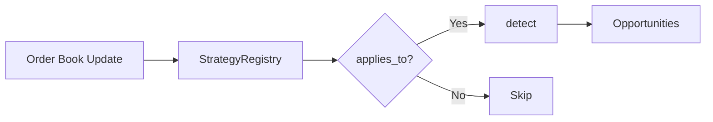

# Strategy System

The strategy system provides pluggable arbitrage detection. Each strategy implements the `Strategy` trait and registers with the `StrategyRegistry`.

## How It Works

On each order book update:

1. `StrategyRegistry` iterates registered strategies
2. Each strategy's `applies_to()` filters by market type
3. Applicable strategies run `detect()` on current state
4. All found opportunities collect and pass to risk manager



## Available Strategies

| Strategy | Market Type | Complexity | Historical Share |
|----------|------------|------------|------------------|
| [Single-Condition](single-condition.md) | Binary (2 outcomes) | O(1) | 27% ($10.5M) |
| [Market Rebalancing](market-rebalancing.md) | Multi-outcome (3+) | O(n) | 73% ($29M) |
| [Combinatorial](combinatorial.md) | Correlated markets | O(ILP) | <1% ($95K) |

## The Strategy Trait

```rust
pub trait Strategy: Send + Sync {
    /// Unique name for logging and config
    fn name(&self) -> &'static str;

    /// Should this strategy run for this market?
    fn applies_to(&self, ctx: &MarketContext) -> bool;

    /// Find opportunities in current market state
    fn detect(&self, ctx: &DetectionContext) -> Vec<Opportunity>;

    /// Optional: warm-start from previous run
    fn warm_start(&mut self, previous: &DetectionResult) {}
}
```

## Configuration

Enable strategies in `config.toml`:

```toml
[strategies]
enabled = ["single_condition", "market_rebalancing"]
```

Each strategy has its own config section. See individual strategy docs for parameters.

## Adding a New Strategy

1. Create module in `src/core/strategy/`
2. Implement `Strategy` trait
3. Add config struct with `#[derive(Deserialize)]`
4. Register in strategy builder
5. Document in `doc/strategies/`
