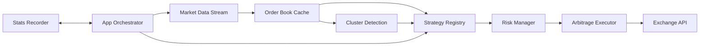

# Architecture Overview

Edgelord separates pure trading logic from exchange adapters and runtime orchestration.

## Design Goals

- Keep strategy logic exchange-agnostic.
- Keep execution gated by explicit risk checks.
- Keep the runtime resilient to network interruptions.
- Keep configuration explicit and auditable.

## High-Level Components

## Module Boundaries

- `src/domain`
  - Exchange-independent entities and value objects.
- `src/port/inbound`
  - Capability contracts exposed to driving adapters (including `operator/*` surfaces for CLI concerns).
- `src/port/outbound`
  - Dependency contracts for driven infrastructure.
- `src/application`
  - Use-case orchestration: event handling, execution flow, strategies, risk, inference, cluster detection.
- `src/adapter/inbound/cli`
  - CLI command parsing and command handlers.
- `src/adapter/outbound`
  - Concrete integrations (Polymarket, SQLite, notifier, solver, LLM).
- `src/infrastructure`
  - Runtime wiring, orchestration, config loading, and operational implementations.

## Runtime Flow

1. Load config and initialize services.
2. Build market registry and subscribe to relevant tokens.
3. Process market events into the order-book cache.
4. Evaluate strategy opportunities.
5. Pass opportunities through risk checks.
6. Execute or reject and record outcomes.

## Resilience and Safety

- Reconnection logic wraps market streams.
- Circuit breakers and exposure limits constrain damage during degraded conditions.
- `dry_run` mode preserves detection flow without sending orders.

## Extensibility

To add another exchange, implement the exchange trait set in `port/outbound/exchange` (`MarketFetcher`, `MarketDataStream`, `ArbitrageExecutor`, `MarketParser`) and register it in the factory path. Core strategies and risk services remain unchanged.
