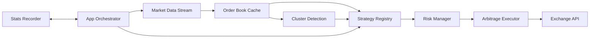

# Architecture Overview

Edgelord separates pure trading logic from exchange adapters and runtime orchestration.

## Design Goals

- Keep strategy logic exchange-agnostic.
- Keep execution gated by explicit risk checks.
- Keep the runtime resilient to network interruptions.
- Keep configuration explicit and auditable.

## High-Level Components

## Module Boundaries

- `src/core/domain`
  - Exchange-independent entities (markets, opportunities, relations, positions).
- `src/core/exchange`
  - Traits and adapters for market data, fetching, and execution.
- `src/core/strategy`
  - Detection algorithms and strategy registry.
- `src/core/service`
  - Risk gating, notification dispatch, stats capture, subscription logic.
- `src/app`
  - Runtime orchestration and config loading.
- `src/cli`
  - End-user command surface.

## Runtime Flow

1. Load config and initialize services.
2. Build market registry and subscribe to relevant tokens.
3. Process market events into the order-book cache.
4. Evaluate strategy opportunities.
5. Pass opportunities through risk checks.
6. Execute or reject and record outcomes.

## Resilience and Safety

- Reconnection logic wraps market streams.
- Circuit breakers and exposure limits constrain damage during degraded conditions.
- `dry_run` mode preserves detection flow without sending orders.

## Extensibility

To add another exchange, implement the exchange trait set and register it in the factory path. Core strategies and risk services remain unchanged.
