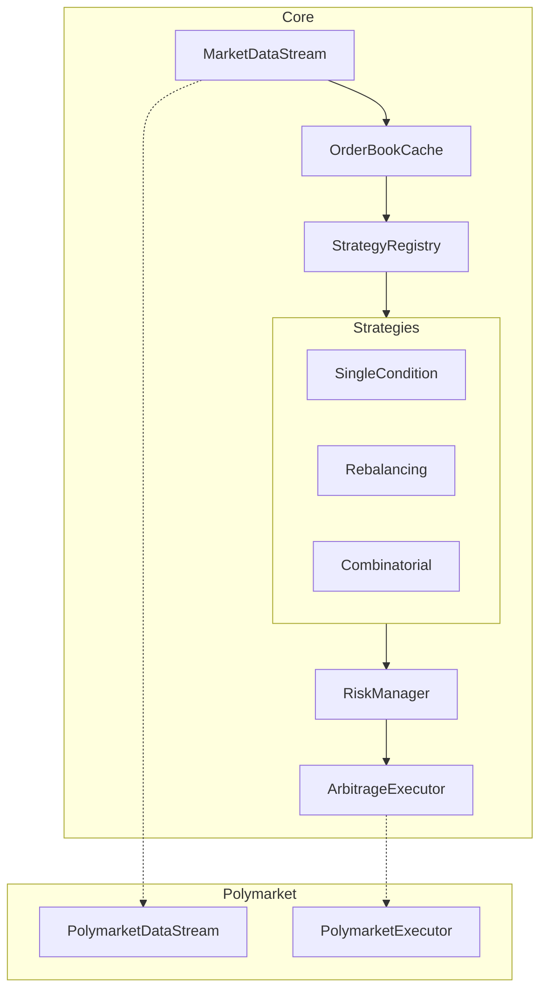
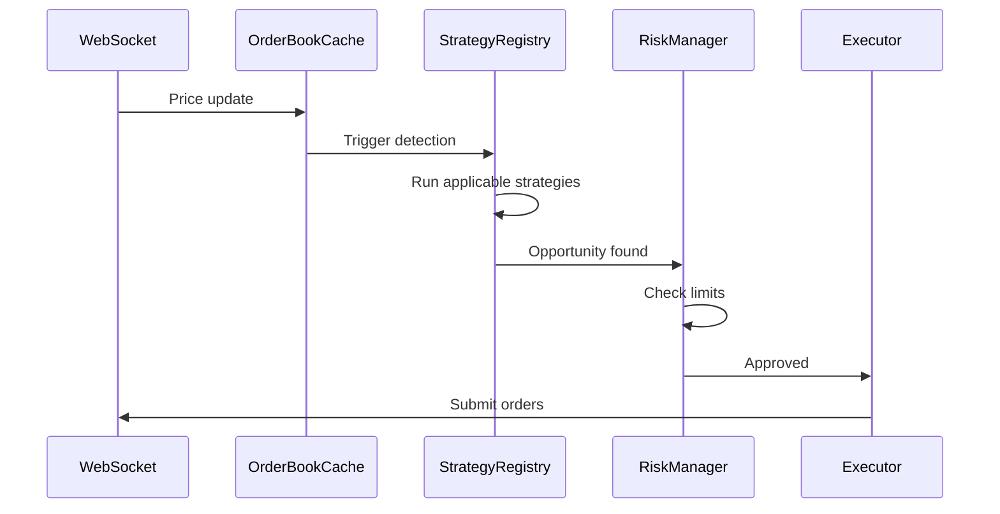

# Architecture Overview

This document covers system design, module structure, and data flow.

## Design Principles

1. **Low latency** — Hot path targets <40ms to compete with sophisticated traders
2. **Strategy pattern** — Pluggable detection algorithms via `Strategy` trait
3. **Exchange abstraction** — Generic traits with exchange-specific implementations
4. **Domain-driven** — Exchange-agnostic core types, Polymarket-prefixed adapters
5. **Fail safe** — Risk checks prevent executing bad trades

## System Overview



## Module Structure

```
src/
├── core/                  # Library code
│   ├── domain/            # Pure types (Market, Opportunity, OrderBook)
│   ├── exchange/          # Exchange traits + implementations
│   ├── strategy/          # Detection algorithms
│   ├── service/           # Risk, notifications, subscriptions
│   ├── solver/            # LP/ILP abstraction (HiGHS)
│   └── cache/             # OrderBookCache, PositionTracker
│
├── app/                   # Application orchestration
│   ├── config/            # Configuration loading
│   ├── orchestrator/      # Main event loop
│   └── state.rs           # Shared state
│
└── cli/                   # Command-line interface
```

## Data Flow

1. **WebSocket receives update** — Price change on exchange (~5ms)
2. **OrderBookCache updates** — Thread-safe cache refreshed (~1ms)
3. **Strategies scan** — Each applicable strategy checks for opportunities (~5ms)
4. **Risk manager validates** — Position limits, exposure, slippage (~1ms)
5. **Executor submits orders** — API calls to exchange (~25ms)
6. **Position tracker records** — Trade logged, exposure updated



## Key Traits

### Strategy

```rust
pub trait Strategy: Send + Sync {
    fn name(&self) -> &'static str;
    fn applies_to(&self, ctx: &MarketContext) -> bool;
    fn detect(&self, ctx: &DetectionContext) -> Vec<Opportunity>;
}
```

### MarketDataStream

```rust
#[async_trait]
pub trait MarketDataStream: Send {
    async fn connect(&mut self) -> Result<()>;
    async fn subscribe(&mut self, token_ids: &[TokenId]) -> Result<()>;
    async fn next_event(&mut self) -> Option<MarketEvent>;
}
```

### ArbitrageExecutor

```rust
#[async_trait]
pub trait ArbitrageExecutor: Send + Sync {
    async fn execute_arbitrage(&self, opp: &Opportunity) -> Result<ExecutionResult>;
    async fn cancel(&self, order_id: &OrderId) -> Result<()>;
}
```

## Risk Management

The `RiskManager` validates every opportunity before execution:

- **Position limits** — Max exposure per market
- **Total exposure** — Portfolio-wide cap
- **Profit threshold** — Skip tiny opportunities
- **Slippage check** — Reject if prices moved too much

Circuit breakers halt trading after consecutive failures, with configurable cooldown.

## Connection Resilience

`ReconnectingDataStream` wraps WebSocket connections with:

- Exponential backoff on failures
- Automatic resubscription after reconnect
- Circuit breaker after N consecutive failures

See [Configuration](../configuration.md) for tuning parameters.
